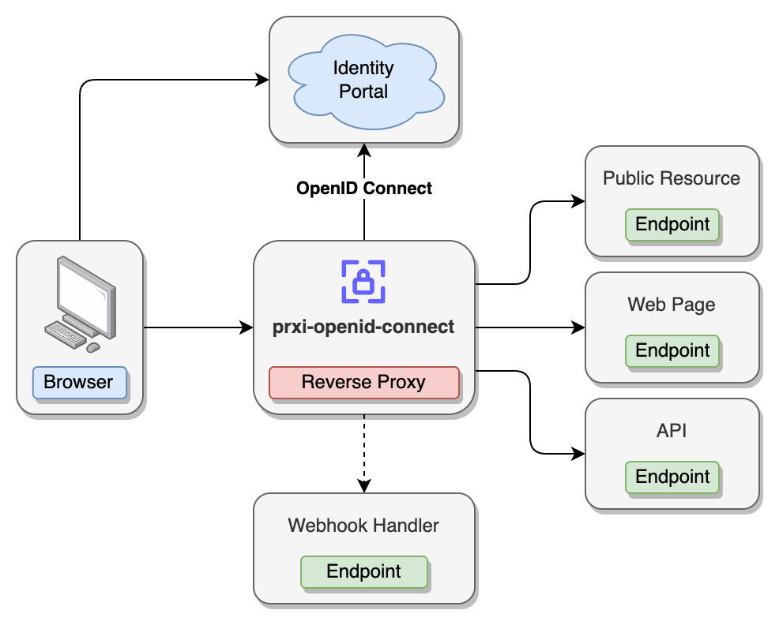

# fireblink/prxi-openid-connect

[OpenID Connect reverse proxy server](https://hub.docker.com/r/fireblink/prxi-openid-connect) that based on a zero-dependency proxy library [prxi](https://www.npmjs.com/package/prxi).

Can be used to provide SSO login (Authentication) functionality to any web application or API service, or both at the same time.
In most of the cases prxi-openid-connect should be deployed in front of your application to intercept all the requests:



Proxy will handle authentication and authorization for individual path mappings, by allowing access only if JWT token contains allowed claims.

Proxy clearly distinguish API and HTML requests, so when access token expires (and can't be refreshed) or missing API request won't return HTML of the login page, but a JSON error object and correct http status code (401). The same applies to a case when access is denied for a user for requested resource (403 error)

In addition upon every login, logout or token refresh action prxi-openid-connect can call optional webhook endpoints and even change the flow based on the response. This might be handy to track audit logs, request token refresh one more time, etc.

## Configuration

### Environment Variables

#### Generic settings
- `PORT` - [optional] port number to listen (default value: `3000`)
- `HOSTNAME` - [optional] hostname to listen incoming connections on (default value: `localhost`)
- `HOST_URL` - Public facing Host URL
- `PROXY_REQUEST_TIMEOUT` - [optional] timeout for the proxy requests (default value: `30000`, 30s)
- `UPSTREAM_URL` - the upstream host URL (default value: none)
- `HEALTH_PATH` - [optional] health check api path (default value: `/_prxi_/health`)
- `LOGOIN_PATH` - [optional] end login endpoint path (default value: `/_prxi_/login`)
- `LOGOUT_PATH` - [optional] end session/logout path (default value: `/_prxi_/logout`)
- `LOG_LEVEL` - [optional] log level (default value: `info`)
- `LOG_FILE` - [optional] log file path (default value: `/prxi/logs/prxi-openid-connect.log`)
- `LOG_FILE_SIZE` - [optional] maximum log file size (default value: `10M`)
- `LOG_FILE_ROTATE` - [optional] maximum number of rotated filed (default value: `5`)
- `JWT_META_TOKEN_SECRET` - [optional] secret string to sign JWT with custom user meta attributes (if returned by the login webhook)

#### OIDC settings
- `OPENID_CONNECT_DISCOVER_URL` - discovery URL, public endpoint to fetch openid-configuration from. E.g.:
  - For KeyCloak `https://{host}/realms/{realm}/.well-known/openid-configuration`
  - For AWS Cognito `https://cognito-idp.{region}.amazonaws.com/{userPoolId}/.well-known/openid-configuration`
- `OPENID_CALLBACK_PATH` - [optional] callback path, that Provider will call upon successful login to exchange code to tokens (default value: `/_prxi_/callback`)
- `OPENID_CLIENT_ID` - Client ID
- `OPENID_CLIENT_SECRET` - [optional] Client Secret
- `OPENID_SCOPE` - [optional] Scope of claims (default value: `openid email profile`)

#### Cookies
- `COOKIES_SECURE` - [optional] whether cookies are secured or not (default value: `true`)
- `COOKIES_ACCESS_TOKEN` - [optional] Access Token cookie name (default value: `prxi-at`)
- `COOKIES_ID_TOKEN` - [optional] ID Token cookie name (default value: `prxi-it`)
- `COOKIES_REFRESH_TOKEN` - [optional] Refresh Token cookie name (default value: `prxi-rt`)
- `COOKIES_ORIGINAL_PATH` - [optional] Cookie name to hold originally request path, only applicable to the HTML page request (default value: `prxi-op`)
- `COOKIES_META` - [optional] Cookie name to hold meta information about the user, only used if login webhook returns `meta` object (default value: `prxi-meta`)

#### Mappings & JWT Claims Path

- `JWT_CLAIM_PATHS` - [optional] JSON object representing paths (array of strings) to obtain mappings from, e.g.

```yaml
{
  # Every path should have a name.
  # Value is an array of string representing nested object fields starting from JWT payload
  # In this example payload.a.b.c will be used to access the claims array
  "name": [ "a", "b", "c" ]
}
```
- `MAPPINGS_PUBLIC` - [optional] represents JSON array with public facing path patterns (no authentication/authorization actions will be performed)
- `MAPPINGS_PAGES` - [optional] represents JSON array with web application pages, generally should refer to the endpoints that return HTML content, as in case of 401 error, proxy server will redirect user to the IDP login page.
- `MAPPINGS_API` - [optional] represents JSON array with API paths, works similar to `MAPPINGS_PAGES` but in case of 401 error server will respond with error:

```yaml
{
  "error": true,
  "details": {
    "message": "Unauthorized",
    "code": 401,
  }
}
```

Mappings format:

```yaml
[
  # each mapping can have 0 or many mappings
  {
    # each mapping requires a RegEx pattern to match the path, note: ^ and $ characters can be omitted
    "pattern": "/public/.*",
    # for non-public mappings claims should be provided that granted access to the resource
    "claims": {
      # claims can reference one or many named paths (refer to the JWT_CLAIM_PATHS environment variable configuration)
      "name": [
        # a hit on either one of the claims can grant user access to the resource
        "role1",
        "role2"
      ]
    }
  }
]
```

It is highly recommended to intercept 401 errors on the Web Application side and reload the page, so `MAPPINGS_PAGES` mapping flow is triggered and user gets redirected to the login page.

#### Redirects
- `REDIRECT_PAGE_REQUEST_ON_404` - [optional] URL to redirect when no mapping found for requested path
- `REDIRECT_PAGE_REQUEST_ON_403` - [optional] URL to redirect when no access is denied, as none of the JWT claims matching mappings

#### Headers

- `HEADERS_CLAIMS_ALL` - [optional] header name to pass all the claims extracted from access/id tokens before calling the upstream service
- `HEADERS_CLAIMS_MATCHING` - [optional] header name to pass just the matching claims extracted from access/id tokens before calling the upstream service
- `HEADERS_INJECT_REQUEST` - [optional] JSON object of additional headers to apply to the request before calling the upstream service
- `HEADERS_INJECT_RESPONSE` - [optional] JSON object of additional headers to apply to the response

Example:
```yaml
{
  # null value removes the header from the request/response
  "Authorization": null,
  # non-null value adds/overrides header in the request/response
  "Content-Security-Policy": "default-src 'self'"
}
```

#### Webhooks
- `WEBHOOK_LOGIN_URL` - [optional]optional URL to make a POST request to, response should be a json object with the following optional fields
  - `refresh: boolean` - [optional] if true, service will use refresh token to fetch new set of tokens, might be useful when webhook endpoint updated user state and new set of tokens should be issued to a user
  - `reject: boolean` - [optional] if true, user won't get the tokens and will see an `Access denied` error
  - `reason: string` - [optional] reason to return instead of `Access denied`
  - `meta: Record<string, any>` - [optional] custom meta attributes associated to a user (make sure to use `JWT_META_TOKEN_SECRET` env variable to set secret and `HEADERS_META` to set the header name to proxy value in)

## Links

- [Docker Image](https://hub.docker.com/r/fireblink/prxi-openid-connect) official Docker image
- [GitHub Repository](https://github.com/FireBlinkLTD/prxi-openid-connect)
- [@prixi/dev](https://www.npmjs.com/package/@prxi/dev) a simple CLI reverse proxy tool for local development purposes, can be handy to simulate fireblink/prxi-openid-connect setup without a need to run docker container and/or setup test IDP configuration
